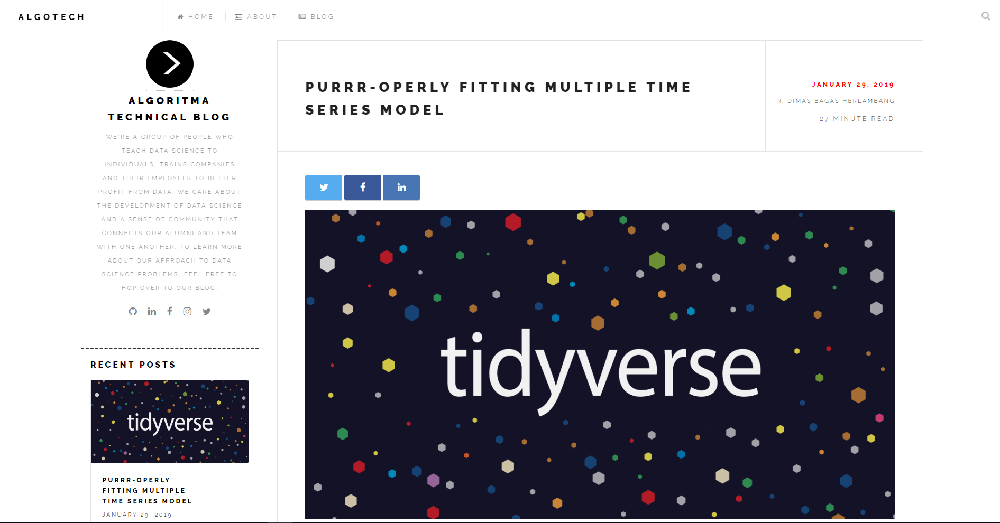

# :star2: Overview Algotech

[](https://app.netlify.com/sites/algotech/deploys) [](#contributors-)


*Algotech* is a Website for technical blog Algoritma. To serve the website locally and to view a live version run the following command:

```
blogdown::serve_site()
```




***

# :memo: Contributing Articles

Please follow the submission guidelines below:

1. Fork the repository.
2. Make a some development version or added a new article.
3. Submit a *pull request*.

If the project owner agrees with your work, they might merged your request into the original repository.

## 1. Fork a Repo 

**Step-1**:

1. On github, navigate to the [teamalgoritma/algoritmablog](https://github.com/teamalgoritma/algoritmablog) repository.
2. On the top-right corner of the page, click *fork*.

**Step-2**: Keep your fork synced using Git. If you haven't yet, you should first [set up Git](https://help.github.com/en/articles/set-up-git#setting-up-git).

1. On github, click **fork** on the *algoritmablog* repository.
2. Open Git Bash
3. Type `git clone`, and then paste the URL of repository. It will look like this, with your GitHub username instead of `YOUR-USERNAME`:

```
$ git clone https://github.com/YOUR-USERNAME/algoritmablog
```
4. Press **Enter**. Your local clone will be created.

```
$ git clone https://github.com/YOUR-USERNAME/algoritmablog
Cloning into 'algoritmablog'...
remote: Enumerating objects: 1592, done.
remote: Counting objects: 100% (1592/1592), done.
remote: Compressing objects: 100% (731/731), done.
remote: Total 1592 (delta 770), reused 1495 (delta 679), pack-reused 0
Receiving objects: 100% (1592/1592), 13.38 MiB | 1.05 MiB/s, done.
Resolving deltas: 100% (770/770), done.
```

5. Type `git remote -v` and press Enter. You'll see the current configured remote repository for your fork.

```
$ git remote -v
> origin  https://github.com/YOUR_USERNAME/algoritmablog.git (fetch)
> origin  https://github.com/YOUR_USERNAME/algoritmablog.git (push)
```

## 2. Create an Article

### YAML Options

Use the following template:

```
title: Creating Choropleth with Mapshaper and R
author: Ardhito Utomo
github: https://github.com/ardhitoutomo
date: '2019-08-18'
slug: creating-choropleth-with-mapshaper-and-r
categories:
  - R
tags: 
  - Geocoding
  - Mapshaper
  - Leaflet
  - Map
  - Data Visualization
description: ''
featured: ''
featuredalt: ''
featuredpath: ''
linktitle: ''
type: post
```

**OR**:

Create a new article by using `New Post` addins on your Rstudio (make sure you already installed *blogdown* packages first).

<center>  </center>


`Tags` are keywords or terms that describe your article. Here are some tags that already exist: 

* `tidyverse`
* `tidymodels`
* `Data Visualization`
* `Machine Learning`
* `Data Manipulation`
* `Capstone ML`

*Note*: Please add `Capstone ML` tags on your YAML options, if you are making an article that aims to help student on capstone project.

### Setup Chunk

Use the following setup chunk options on your Rmd files.

```
# clean up the environment
rm(list = ls())

# setup chunk options
knitr::opts_chunk$set(
  message = FALSE,
  warning = FALSE,
  fig.align = "center",
  comment = "#>"
)
```

### Insert Article rmd and Data Input
1. Make sure your article' rmd is in accordance with the settings in the previous step
2. Move your article to `/content/blog/`
3. Create new folder and save your data input on `/content/blog/data_input/*your topic article*

```{r}
some_object <- read.csv("data_input/article-topic/filename.csv")
```

### Insert Images

1. Create new folder *your topic article* on `/public/img/`.
2. Save your images on `/public/img/ARTICLE-TOPIC` with a template `imgname.png`.
3. Embed the images with the following command, and options `echo = FALSE`.

```
knitr::include_graphics('/img/article-topic/imgname.png')
```

4. If, the images does not appear, change the command on your Rmd (narration) file (not in code chunk) to:

```
<center> {width="60%"} </center>
```

5. Convert your rmd to html by running `blogdown::serve_site()`. The HTML need to be save in same directory with the rmd

## 3. Submit Pull Request! :grin:

* Save your article
* To test whether your article was successfully created or not, serve the website locally with `blogdown::serve_site`.
* Open git bash
  * `git add .`
  * `git commit -m 'your message'`
  * `git push`
* then submit a pull request to algoritma blog repository.


## Contributors ✨

<!-- ALL-CONTRIBUTORS-LIST:START - Do not remove or modify this section -->
<!-- prettier-ignore-start -->
<!-- markdownlint-disable -->
<table>
  <tr>
    <td align="center"><a href="http://hsnabd.netlify.com"><br /><sub><b>Ahmad Husain Abdullah</b></sub></a><br /><a href="#maintenance-ahmadhusain" title="Maintenance">🚧</a> <a href="https://github.com/teamalgoritma/algoritmablog/commits?author=ahmadhusain" title="Code">💻</a><a href="#ideas-ahmadhusain" title="Ideas & Planning">🤔</a></td>
    <td align="center"><a href="https://github.com/ysitta"><br /><sub><b>Yaumil Sitta</b></sub></a><br /><a href="#content-ysitta" title="Content">🖋</a><a href="#projectManagement-ysitta" title="Project Management">📆</a><a href="#review-ysitta" title="Reviewed Pull Requests">👀</a></td>
    <td align="center"><a href="http://algorit.ma"><br /><sub><b>Nabiilah Ardini Fauziyyah</b></sub></a><br /><a href="#content-NabiilahArdini" title="Content">🖋</a><a href="#blog-NabiilahArdini" title="Rplicate Series">📝</a></td>
    <td align="center"><a href="https://github.com/Argaadya"><br /><sub><b>Argaadya</b></sub></a><br /><a href="#content-Argaadya" title="Content">🖋</a></td>
    <td align="center"><a href="https://www.linkedin.com/in/iqbalbasyar"><br /><sub><b>iqbalbasyar</b></sub></a><br /><a href="#content-iqbalbasyar" title="Content">🖋</a></td>
    <td align="center"><a href="http://Rpubs.com/david21"><br /><sub><b>David</b></sub></a><br /><a href="#content-Davidlimbong" title="Content">🖋</a></td>
    <td align="center"><a href="https://github.com/inytss"><br /><sub><b>Inayatus</b></sub></a><br /><a href="#content-inytss" title="Content">🖋</a></td>
  </tr>
  <tr>
    <td align="center"><a href="https://github.com/ajengprstw"><br /><sub><b>ajengprstw</b></sub></a><br /><a href="#content-ajengprstw" title="Content">🖋</a></td>
    <td align="center"><a href="https://www.linkedin.com/in/tomytjandra/"><br /><sub><b>Tomy Tjandra</b></sub></a><br /><a href="#content-tomytjandra" title="Content">🖋</a></td>
    <td align="center"><a href="https://github.com/Litaa"><br /><sub><b>Dyah Nurlita</b></sub></a><br /><a href="#content-Litaa" title="Content">🖋</a></td>
    <td align="center"><a href="https://medium.com/@joenathanchristian"><br /><sub><b>Joe Cristian</b></sub></a><br /><a href="#content-western11" title="Content">🖋</a></td>
    <td align="center"><a href="https://github.com/ttnsy"><br /><sub><b>ttnsy</b></sub></a><br /><a href="#content-ttnsy" title="Content">🖋</a></td>
    <td align="center"><a href="https://github.com/t3981-h"><br /><sub><b>t3981</b></sub></a><br /><a href="#content-t3981" title="Content">🖋</a></td>
    <td align="center"><a href="https://github.com/wulanandriyani"><br /><sub><b>wulanandriyani</b></sub></a><br /><a href="#content-wulanandriyani" title="Content">🖋</a></td>
  </tr>
  <tr>
    <td align="center"><a href="https://github.com/HafizahIlma"><br /><sub><b>HafizahIlma</b></sub></a><br /><a href="#content-HafizahIlma" title="Content">🖋</a></td>
    <td align="center"><a href="https://github.com/AltruiMetavasi"><br /><sub><b>shelloren</b></sub></a><br /><a href="#design-AltruiMetavasi" title="Design">🎨</a></td>
  </tr>
</table>

<!-- markdownlint-restore -->
<!-- prettier-ignore-end -->

<!-- ALL-CONTRIBUTORS-LIST:END -->

This project follows the [all-contributors](https://github.com/all-contributors/all-contributors) specification. Contributions of any kind welcome!