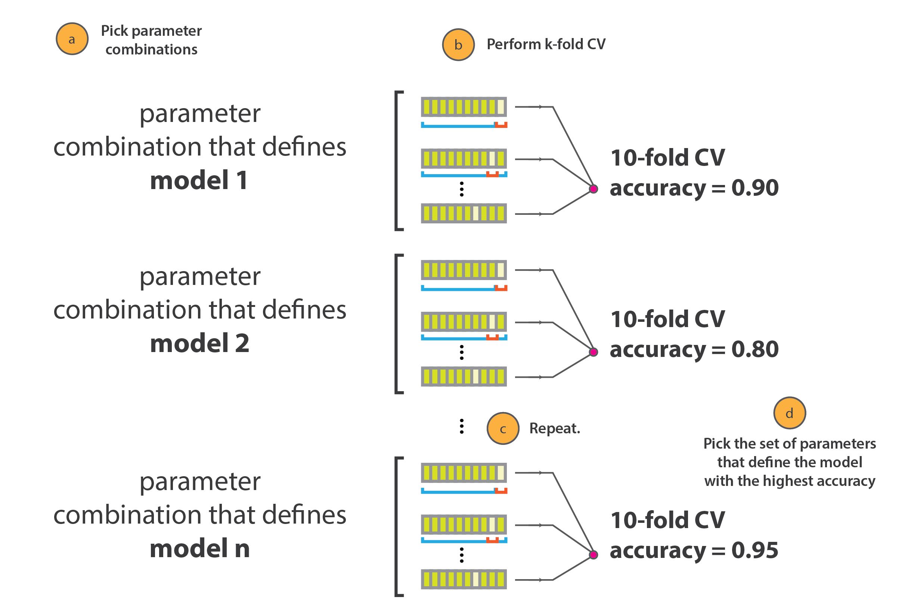

```{r setup, include=FALSE}
# clear-up the environment
rm(list = ls())

# chunk options
knitr::opts_chunk$set(
  message = FALSE,
  warning = FALSE,
  fig.align = "center",
  comment = "#>"
)

library(reticulate)

reticulate::use_python(python = '/Users/ariqleesta/opt/anaconda3/envs/ariq/bin/python', required = T)
sys <- import("sys")
py_run_string("import os")
py_run_string("os.environ['QT_QPA_PLATFORM_PLUGIN_PATH'] = '/Users/ariqleesta/opt/anaconda3/plugins/platforms'")
```

## Background

Proses pengerjaan *machine learning* pada umumnya meliputi uji coba berbagai model terhadap dataset dengan memilih model dengan performa terbaik. Untuk mendapatkan hasil prediksi data yang akurat, diperlukan tidak hanya model *machine learning* yang tepat, tetapi juga *hyperparameter* (parameter yang mengatur proses pembelajaran mesin) yang tepat pula yang dikenal dengan istilah *hyperparameter tuning*. Menentukan kombinasi yang tepat antara model dan *hyperparameter* seringkali menjadi tantangan.

*Grid Search Cross Validation* adalah **metode pemilihan kombinasi model dan *hyperparameter*** dengan cara menguji coba satu persatu kombinasi dan melakukan validasi untuk setiap kombinasi. Tujuannya adalah menentukan kombinasi yang menghasilkan performa model terbaik yang dapat dipilih untuk dijadikan model untuk prediksi.

<center> {width="60%"} </center>

Artikel ini akan membahas bagaimana cara mengoptimasi model *machine learning* dengan menggunakan metoda *Grid Search Cross Validation*. Dengan adanya *Grid Search Cross Validation*, proses pemilihan model dan *hyperparameter tuning* menjadi lebih mudah. *Grid Search Cross Validation* melakukan validasi untuk setiap kombinasi model dan *hyperparameter* secara otomatis sehingga dapat menghemat waktu proses pengerjaan.

## Import Library

Import *library* umum yang digunakan dalam pengolahan data.

```{python}
import pandas as pd
import numpy as np
import warnings
warnings.filterwarnings('ignore')

import matplotlib.pyplot as plt
import seaborn as sns
```

## Data Understanding

Data yang digunakan pada artikel ini adalah data [Vehicle](https://www.kaggle.com/nehalbirla/vehicle-dataset-from-cardekho) yang diperoleh dari kaggle . Model *machine learning* pada kasus ini dirancang untuk memprediksi harga mobil bekas berdasarkan kondisi kendaraan saat dijual.

```{python}
df = pd.read_csv('data_input/Car_details_v3.csv')
```

```{python}
df.head()
```

```{python}
df.shape
```

Data ini terdiri dari 8128 baris dengan 13 kolom. Kolom <code>selling_price</code> akan menjadi *target value* (nilai yang akan diprediksi). Berikut adalah deskripsi dari data ini.

```{python}
df.describe(include = 'all')
```

Kemudian perlu dilakukan pengecekan struktur data (tipe data) dan *missing value* pada dataset ini. Pengamatan terkait *missing value* dapat dilakukan secara *visual* dengan bantuan *library* <code>missingno</code>.

```{python}
import missingno as msno
plt.figure()
msno.matrix(df, figsize = (15,10))
plt.show()
```

Berikut adalah informasi tekstual mengenai data yang hilang dan tipe data dari masing-masing kolom pada dataset ini.

```{python}
df.info()
```

## Data Preparation

Drop baris yang memiliki data yang hilang.

```{python}
df.dropna(inplace = True)
```

Pisahkan data numerik dan data kategorikal.

```{python}
numerics = ['int16', 'int32', 'int64', 'float16', 'float32', 'float64']

# Data numerik
df_num = df.select_dtypes(include=numerics)

# Data kategorikal
df_cat = df.drop(columns = df_num.columns, axis = 1)
```

```{python}
df_num.head()
```

```{python}
df_cat.head()
```

Pada data kategorikal, dapat dilihat bahwa beberapa kolom merupakan data yang dapat dijadikan numerik karena mengandung angka di dalamnya, yaitu data pada kolom <code>mileage</code>, <code>engine</code>, <code>max_power</code>, dan <code>torque</code>. Maka perlu dilakukan ekstraksi dengan bantuan *regular expression* untuk mengambil angka saja. Angka yang telah di ekstrak akan di format menjadi *float* atau *integer* dan dijadikan kolom baru pada dataframe numerik <code>df_num</code>.

```{python}
df_num['mileage_kmpl'] = df_cat['mileage'].str.extract(r'([0-9.,]+)').astype('float')
df_num['engine_CC'] = df_cat['engine'].str.extract(r'([0-9.,]+)').astype('float')
df_num['max_power_bhp'] = df_cat['max_power'].str.extract(r'([0-9.,]+)').astype('float')
```

Untuk kolom <code>torque</code>, dipisahkan menjadi 3 bagian, yaitu nilai **Nm**, **rpm minimum**, dan **rpm maksimum**. Apabila angka **rpm** hanya satu, **rpm maksimum** diasumsikan sama dengan **rpm minimum**.

```{python}
df_cat['torque']
```

```{python}
df_cat['torque'].str.extract(r'([.,0-9]+).*').head()
```

```{python}
df_cat['torque'].str.extract(r'[0-9.,].+?[a-zA-Z@].+?([0-9.,]+)').replace(',','', regex=True).head()
```

```{python}
df_cat['torque'].str.extract(r'([\d,.]+)(?!.*\d)').replace(',','', regex=True).head()
```

```{python}
df_num['torque_Nm'] = df_cat['torque'].str.extract(r'([.,0-9]+).*').astype('float')
df_num['torque_rpm_min'] = df_cat['torque'].str.extract(r'[0-9.,].+?[a-zA-Z@].+?([0-9.,]+)').replace(',','', regex=True).astype('float')
df_num['torque_rpm_max'] = df_cat['torque'].str.extract(r'([\d,.]+)(?!.*\d)').replace(',','', regex=True).astype('float')
```

```{python}
df_num.head()
```

Hapus kolom <code>mileage</code>, <code>engine</code>, <code>max power</code>, dan <code>torque</code> pada dataframe kategori karena kolom-kolom tersebut sudah menjadi bagian dari data numerikal.

```{python}
df_cat.drop(columns = ['mileage', 'engine', 'max_power', 'torque'], axis = 1, inplace = True)
```

```{python}
df_cat.head()
```

## EDA and Feature Selection

Untuk menentukan fitur-fitur yang diperlukan pada data numerik, perlu dilihat korelasi fitur-fitur tersebut terhadap variabel <code>selling_price</code> selaku *target value* yang akan diprediksi.

```{python}
plt.figure(figsize = (15,15))
sns.heatmap(df_num.corr(), annot = True)
plt.show()
```

```{python}
plt.figure()
sns.pairplot(df_num)
```

Pilih fitur-fitur yang memiliki korelasi tertinggi terhadap <code>selling_price</code>, pada kasus ini diambil fitur yang memiliki korelasi di atas 0.4. Fitur numerik dengan korelasi tertinggi dimuat di dalam variabel <code>highest_corr_features</code>.

```{python}
plt.figure(figsize = (15,15))
corr = df_num.corr()

# Ambil fitur dengan korelasi dengan selling_price di atas 0.4
highest_corr_features = corr.index[abs(corr["selling_price"])>0.4]

plt.figure(figsize=(10,10))
g = sns.heatmap(df_num[highest_corr_features].corr(),annot=True,cmap="RdYlGn")
plt.show()
```

Untuk fitur data kategorikal, perlu dilihat terlebih dahulu berapa banyak *unique value* dari fitur tersebut.

```{python}
df_cat.nunique()
```

Karena kolom <code>name</code>  *unique value* nya sangat banyak, kolom <code>name</code> sebaiknya di drop karena sangat sedikit berpengaruh terhadap performa model. Selanjutnya akan dilakukan *One-Hot Encoding* (mengubah setiap kategori menjadi kolom) yang berisi nilai antara 0 atau 1.

```{python}
# drop kolom name
df_cat.drop(columns = ['name'], axis = 1, inplace = True)
```

```{python}
# Lakukan One-Hot Encoding
df_cat = pd.get_dummies(df_cat)
```

```{python}
df_cat.head(3)
```

Selanjutnya akan dilakukan pemilihan fitur kategorikal. Fitur kategorikal dipilih berdasarkan nilai *chi-squared* terbesar. Semakin tinggi nilai *chi squared* maka semakin signifikan pengaruh fitur tersebut terhadap *target value*. Fitur kategorikal terbaik dimuat di dalam valiabel <code>top_cat</code> yang memuat 5 fitur terpenting.

```{python}
# Selanjutnya memilih fitur kategorikal yang penting berdasarkan nilai chi2
from sklearn.feature_selection import SelectKBest
from sklearn.feature_selection import chi2
```

```{python}
# Applying kbest algo
ordered_rank_features = SelectKBest(score_func=chi2, k=14)
ordered_feature = ordered_rank_features.fit(df_cat,df_num['selling_price'])
ordered_feature.scores_

df_scores = pd.DataFrame(ordered_feature.scores_, columns=['Score'])
df_columns = pd.DataFrame(df_cat.columns)
univariate_ranked = pd.concat([df_columns, df_scores],axis=1)
univariate_ranked.columns = ['Features', 'Scores']
univariate_ranked.set_index('Features', inplace = True)

# Ambil 5 fitur paling penting
top_cat = univariate_ranked.sort_values('Scores', ascending = False).head()
top_cat
```

Data kategorikal dan data numerikal disatukan kembali menjadi dataframe baru dengan nama <code>df_new</code>.

```{python}
df_new = pd.concat([df_num, df_cat], axis = 1)
```

```{python}
df_new.head()
```

```{python}
# cek kembali data yang hilang
df_new.isnull().sum()
```

```{python}
# drop missing values
df_new.dropna(inplace = True)
```

```{python}
df_new.head()
```

## Data Preprocessing

Pada tahap ini akan dilakukan *preprocessing* yaitu pemrosesan data awal yang bertujuan untuk mempersiapkan data agar dapat diterima oleh model *machine learning* dengan baik. Pada tahapan ini meliputi penentuan *target value* <code>y</code>, penentuan prediktor <code>X</code>, normalisasi data, dan *train test split*.

```{python}
# Tentukan target value (y)
y = df_new['selling_price']
```

```{python}
# Menentukan predictor
# Fitur yang diambil untuk menjadi predictor adalah fitur yang telah melalui proses seleksi
# Highest corr features adalah fitur numerik dengan korelasi terhadap price yang tinggi
highest_corr_features.tolist()
```

```{python}
# top_cat adalah fitur kategori dengan nilai chi2 terhadap price yang tertinggi
top_cat.index.tolist()
```

```{python}
# Tentukan predictor (X) dengan melakukan subsetting dataframe
X = df_new[top_cat.index.tolist()+highest_corr_features.tolist()]
```

Setelah ditentukan *target value* dan *predictor*, dilanjutkan dengan normalisasi data menggunakan *MinMaxScaler* dan pembagian data train dan data test atau biasa dikenal dengan istilah *train test split*.

```{python}
from sklearn.preprocessing import MinMaxScaler
from sklearn.model_selection import train_test_split
from sklearn.metrics import r2_score, mean_squared_error
```

```{python}
# Normalisasi data
sc = MinMaxScaler()
X = sc.fit_transform(X)
```

```{python}
# Train test split
X_train, X_test, y_train, y_test = train_test_split(X, y, test_size = 0.2, random_state = 0)
X_train.shape, X_test.shape, y_train.shape, y_test.shape
```

## Model Selection with GridSearchCV

*GridSearchCV* merupakan bagian dari modul *scikit-learn* yang bertujuan untuk melakukan validasi untuk lebih dari satu model dan hyperparameter masing-masing secara otomatis dan sistematis. Sebagai contoh, kita ingin mencoba model *Decision Tree* *hyperparameter* <code>min_samples_leaf</code> dengan nilai 1, 2, dan 3 dan <code>min_samples_split</code> dengan nilai 2,3, dan 4. *GridSearchCV* akan memilih *hyperparameter* mana yang akan memberikan model performa yang terbaik. Pada kasus ini, nilai <code>cv</code> diset 5 yang menandakan setiap kombinasi model dan parameter divalidasi sebanyak 5 kali dengan membagi data sebanyak 5 bagian sama besar secara acak (4 bagian untuk training dan 1 bagian untuk testing).

```{python}
from sklearn.model_selection import GridSearchCV
from sklearn.tree import DecisionTreeRegressor

model = DecisionTreeRegressor()

parameters = {
        'min_samples_leaf': [1, 2, 3],
        'min_samples_split': [2, 3, 4]
        }
```

```{python}
search = GridSearchCV(model,
                        parameters,
                        cv = 5,
                        
                        verbose=3)
search.fit(X, y)
```

Setelah dilakukan *Grid Search*, skor dan parameter terbaik dapat ditentukan seperti berikut ini.

```{python}
search.best_score_, search.best_params_
```

Parameter tersebut dapat langsung digunakan untuk melakukan prediksi terhadap <code>selling_price</code>.

```{python}
model = DecisionTreeRegressor(min_samples_leaf = search.best_params_['min_samples_leaf'], 
                              min_samples_split = search.best_params_['min_samples_split'])
model.fit(X_train, y_train)

y_pred = model.predict(X_test)

print('r-squared is ', r2_score(y_test, y_pred),' and root_mean_squared_error is ',  mean_squared_error(y_test, y_pred, squared = False))
```

```{python}
def plot_result(prediction, actual):
  plt.figure(figsize = (7,7))
  plt.scatter(prediction, actual, color = 'r', s = 5)
  plt.xlabel('Prediction')
  plt.ylabel('Actual')
  plt.plot([0,3e6], [0,3e6])
  plt.show()
  
plot_result(y_pred, y_test)
```

Apabila ingin mencoba lebih dari satu buah model, grid search dilakukan dengan melakukan iterasi untuk setiap model. Karena setiap model memiliki input parameter yang berbeda-beda, iterasi harus berjalan untuk setiap model sesuai dengan parameternya masing-masing. Untuk menangani hal tersebut, perlu dirancang kumpulan *dictionary* sebagai berikut ini. Asumsikan kita ingin mencoba mode *Linear Regression*, *Decision Tree Regressor*, dan *Random Forest Regressor* dengan masing-masing parameter seperti tertera di bawah ini.

```{python}
from sklearn.linear_model import LinearRegression
from sklearn.ensemble import RandomForestRegressor

model_params = {
    'linear_regression': {
        'model': LinearRegression(),
        'params' : {
            # No Parameter
        }  
    },
    'decision_tree': {
        'model': DecisionTreeRegressor(),
        'params' : {
            'min_samples_leaf' : [1,2,3]
        }
    },
    'random_forest': {
        'model': RandomForestRegressor(),
        'params' : {
            'n_estimators': [100, 500],
            'min_samples_leaf' : [1,2,3]
        }
    },    

}
```

GridSearchCV dilakukan dengan iterasi untuk setiap model. Skor dan parameter terbaik disimpan di dalam list <code>scores</code> yang nantinya akan dimuat dalam bentuk dataframe.

```{python}
scores = []

for model_name, mp in model_params.items():
    clf =  GridSearchCV(mp['model'], mp['params'], cv=5, return_train_score=False)
    clf.fit(X, y)
    scores.append({
        'model': model_name,
        'best_score': clf.best_score_,
        'best_params': clf.best_params_
    })
    
score_df = pd.DataFrame(scores,columns=['model','best_score','best_params'])
score_df
```

Dapat dilihat bahwa model *Simple Linear Regression* memiliki *r-squared* *score* tertinggi. Sehingga model ini dapat langsung digunakan untuk memprediksi *target value*.

```{python}
model = LinearRegression()
model.fit(X_train, y_train)

y_pred = model.predict(X_test)
print('r-squared is ', r2_score(y_test, y_pred),' and root_mean_squared_error is ',  mean_squared_error(y_test, y_pred, squared = False))
```

```{python}
plot_result(y_pred, y_test)
```

## Conclusion

Penentuan hasil prediksi dari suatu data dititikberatkan pada pemilihan model dan parameter yang baik. *Grid Search Cross Validation* mempermudah kita dalam menguji coba setiap model dan parameter model *machine learning* tanpa harus mencoba melakukan validasi secara manual satu persatu. Penerapan *Grid Search Cross Validation* yang disandingkan dengan pemahaman dan intuisi yang baik terkait model *machine learning* dan data yang digunakan akan memberikan hasil prediksi yang akurat dan optimal.

[Dokumentasi GridSearchCV library sklearn](https://scikit-learn.org/stable/modules/generated/sklearn.model_selection.GridSearchCV.html)

[Data Vehicle Kaggle](https://www.kaggle.com/nehalbirla/vehicle-dataset-from-cardekho)

[Cross Validation and Grid Search for Model Selection in Python](https://stackabuse.com/cross-validation-and-grid-search-for-model-selection-in-python/)

